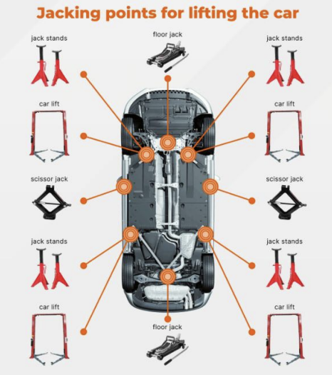
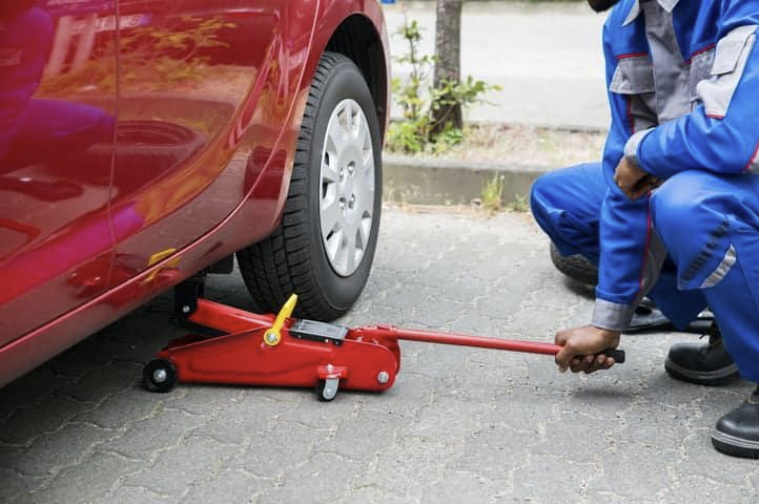
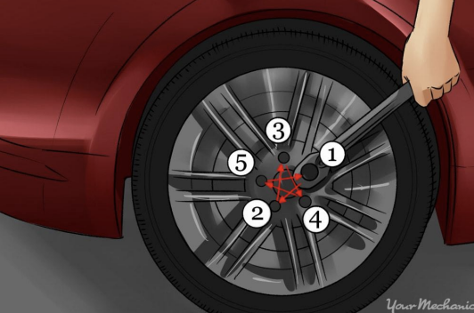

# How to Change a Flat Tire on a Car

These instructions explain how to change a flat tire using a car jack and a lug wrench.

# Instructions
Step 1: Park the car on a flat and stable surface.

Step 2: Turn on your hazard lights.

Step 3: Turn off your car.

Step 4: Place the lug wrench onto one lug nut on the flat tire.

Step 5: Turn the lug wrench counterclockwise to loosen the lug nut without removing it completely.

Step 6: Repeat Steps 4 and 5 with the other lug nuts on your tire in any order of your choosing.

Step 7: Position the car jack under any of the jack points on your car. (See Figure 1)

Step 8: Turn the jack handle clockwise to raise the vehicle until the tire lifts 3-6 inches off the ground. (See Figure 2)

Step 9: Take out all loosened lug nuts from the wheel with your hand.

Step 10: Grab the wheel with both hands on each side.

Step 11: Pull the flat tire straight off the wheel hub.

Step 12: Pick up your spare tire with both hands.

Step 13: Line your spare tire up with the wheel bolts.

Step 14: Twist the lug nuts back on clockwise to the wheel bolts by hand.

Step 15: Turn the car jack handle counterclockwise to lower vehicle
back to the ground.

Step 16: Tighten any lug nut clockwise using a lug wrench.

Step 17: Tighten the lug nut across from the previous lug nut that you
tightened.

Step 18: Repeat Steps 16-17 until all lug nuts are tightened. (See Figure 3)

